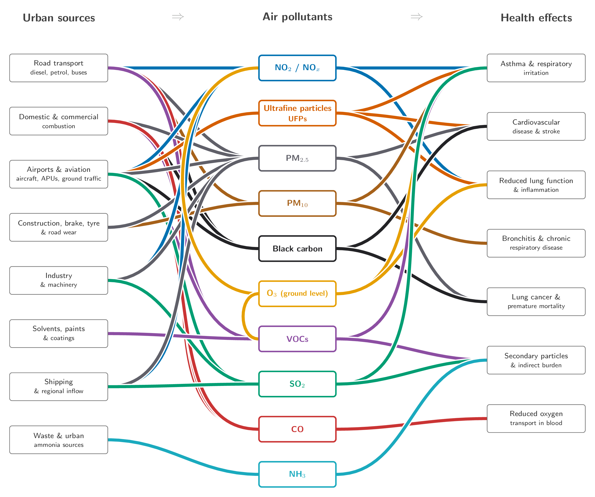

<link rel="stylesheet" href="css/style3.css"> 
<link rel="stylesheet" href="css/copycode.css"> 
<link rel="stylesheet" href="css/button.css"> 
<link rel="stylesheet" href="css/headerfooter.css"> 
<link rel="stylesheet" href="css/table.css"> 
<link rel="stylesheet" href="css/tree.css"> 
<link rel="stylesheet" href="css/rowcol.css"> 
<link rel="stylesheet" href="css/details.css">
<link rel="stylesheet" href="css/figure.css">

## Workshop details

Date | Monday, 6 July 2026
:-|:---
Time | 10:00 - 12:00
Location | London City Hall, Kamal Chunchie Way, London E16 1ZE, UK
Event page | [https://luma.com/3cq829o7](https://luma.com/3cq829o7)

::: pline

### Summary 

​This hands-on, collaborative workshop invites Londoners to step into the role of urban data analysts to examine the city's air quality. Utilising open-access datasets from the London Air Quality Network (LAQN) and local monitoring centres, participants will map pollution hotspots, trace historical trends across different boroughs and investigate the micro-effects of local traffic and green infrastructure.

​The event acts as a bridge between hard environmental science and local community experience. Participants will work in small teams to look at the data, draw insights about their own neighbourhoods, and collaboratively draft data-driven recommendations for cleaner borough streets. Rather than viewing air pollution solely as an environmental problem, the workshop introduces participants to the idea that air quality is an emergent property of London's wider urban system. Participants will be encouraged to consider how infrastructure investment, transport planning, and urban design can contribute to healthier and more liveable communities.

:::

## Why study air quality? {.c}

::: outline

### Air pollution

- is one of the [leading environmental risks to human health]{.h}, contributing to respiratory disease, cardiovascular disease and other chronic health conditions.
	- Air pollution is not [distributed evenly across London]{.h}. Exposure varies between boroughs, neighbourhoods, individual streets and different times of day.
		- Understanding where pollution occurs is essential for [designing healthier and more liveable cities]{.h}. 
		- [Open environmental data]{.h} now allow anyone, not just researchers or government agencies, to investigate air quality in their own communities.

:::

::: outline

### Maps and Data Visualisations

-  transform complex datasets into evidence that can [inform public discussion, policy and local decision making.]{.h}
	- [Data do not provide answers on their own.]{.h} They help us formulate hypotheses, identify patterns and ask better questions about how cities function.

::: 

::: pline

- [Air quality is an **emergent property** of London's urban system. ]{.u}
	- It arises from the interaction of transport, land use, economic activity, green infrastructure and weather rather than from any single factor.

:::


## Why is air pollution so difficult to understand? {.c}


### Multiple Source, Multiple Effects

::: outline

- [There is **no single source** of **urban air pollution.**]{.h} 
	- Road transport, domestic heating, airports, construction, industry and shipping all contribute to the air that Londoners breathe.
- [Each **urban activity** emits **several pollutants simultaneously.** ]{.h}
	- For example, road transport emits nitrogen oxides, particulate matter, black carbon, carbon monoxide and volatile organic compounds.
- [Each pollutant can originate from **multiple sources.**]{.h}
	- [Fine particulate matter (PM₂.₅)]{.h}, for example, is produced by traffic, domestic heating, aviation, industry and regional transport.
	- Some **pollutants are formed after they are emitted.** 
		- Ground-level ozone and secondary particulate matter are created through chemical reactions in the atmosphere, making pollution dependent on both emissions and weather conditions.
- [**Different pollutants affect** the **human body** in **different ways.**]{.h} 
	- Some primarily damage the respiratory system, others increase the risk of **cardiovascular disease**, while many contribute to several health conditions simultaneously.
	
:::

### Many-to-many Relationship

::: outline

- The [relationship]{.u} between **sources**, **pollutants** and **health effects** is therefore a [**many-to-many relationship** system.]{.u} 
	- Each source contributes to multiple pollutants, and each pollutant contributes to multiple health outcomes. 
	- This [**complexity**]{.h} is why air pollution cannot be understood through intuition alone and why mapping, **data analysis** and **systems thinking** are essential.

:::


## Sources, Pollutants and Health Impacts Pathways {.c}



## London Data Week | Camden Colab Github Notebook

### Google Colab Notebook link

[colab.research.google.com/drive/1On4wfqxvFduKTYHHoyCWIPxo7JZ1Iiku?usp=sharing](https://colab.research.google.com/drive/1On4wfqxvFduKTYHHoyCWIPxo7JZ1Iiku?usp=sharing){target="_blank"}

```
https://colab.research.google.com/drive/1On4wfqxvFduKTYHHoyCWIPxo7JZ1Iiku?usp=sharing
```

## Air Pollution Data 


- [NO2 csv file for Camden ](https://econversation.github.io/ldn/data/camden/pollution/NO2_Camden.csv){target="_blank"} 
- [NOx csv file for Camden](https://econversation.github.io/ldn/data/camden/pollution/NOx_Camden.csv){target="_blank"} 
- [PM10d csv file for Camden](https://econversation.github.io/ldn/data/camden/pollution/PM10d_Camden.csv){target="_blank"} 
- [PM10m csv file for Camden](https://econversation.github.io/ldn/data/camden/pollution/PM10m_Camden.csv){target="_blank"} 
- [PM25 csv file for Camden](https://econversation.github.io/ldn/data/camden/pollution/PM25_Camden.csv){target="_blank"} 

## Group Study

[Explore the pollution maps of various boroughs of London](boroughs.html) 

## Wider discussion about London

[Explore the pollution maps of Greater London](london.html) 

