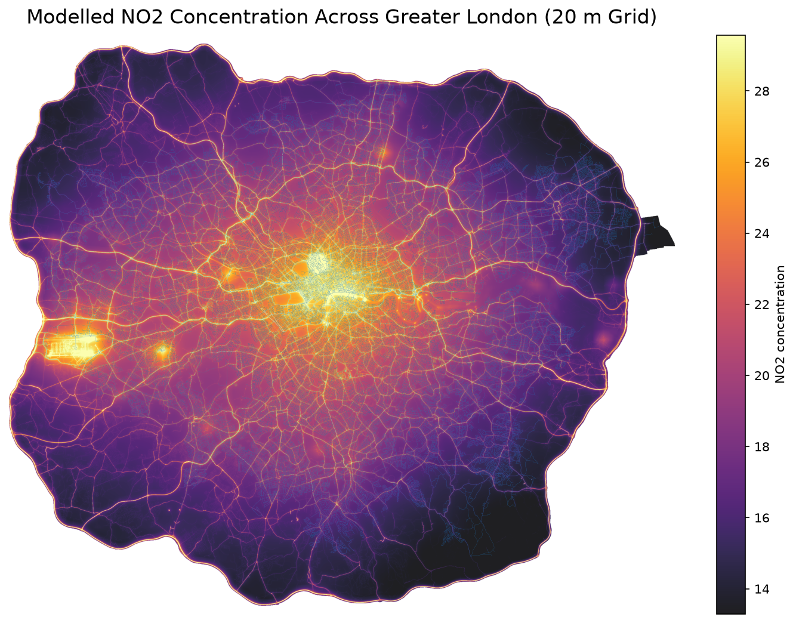
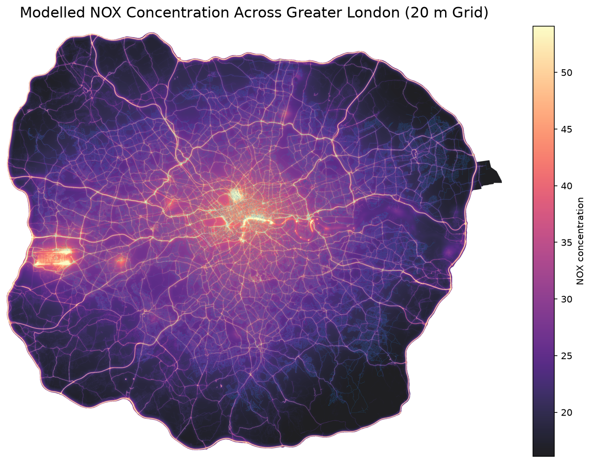
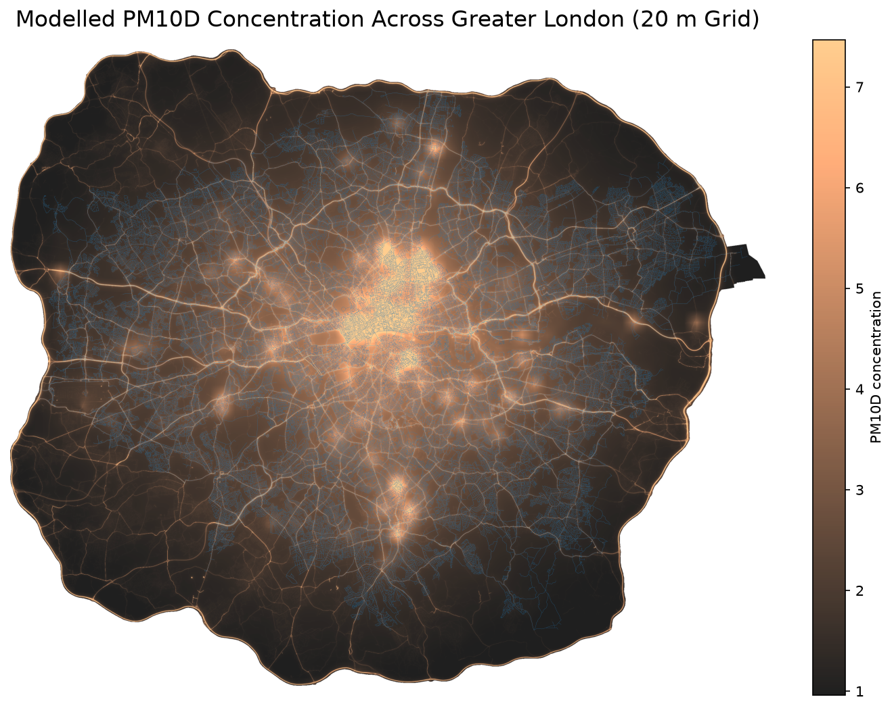
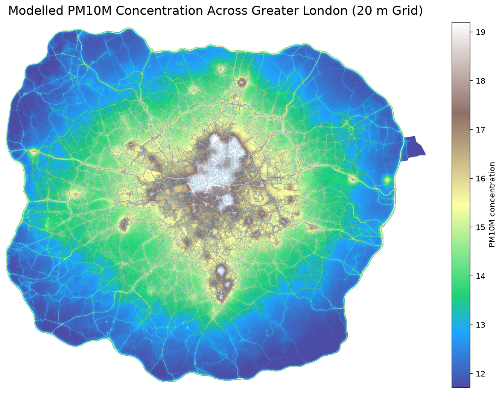
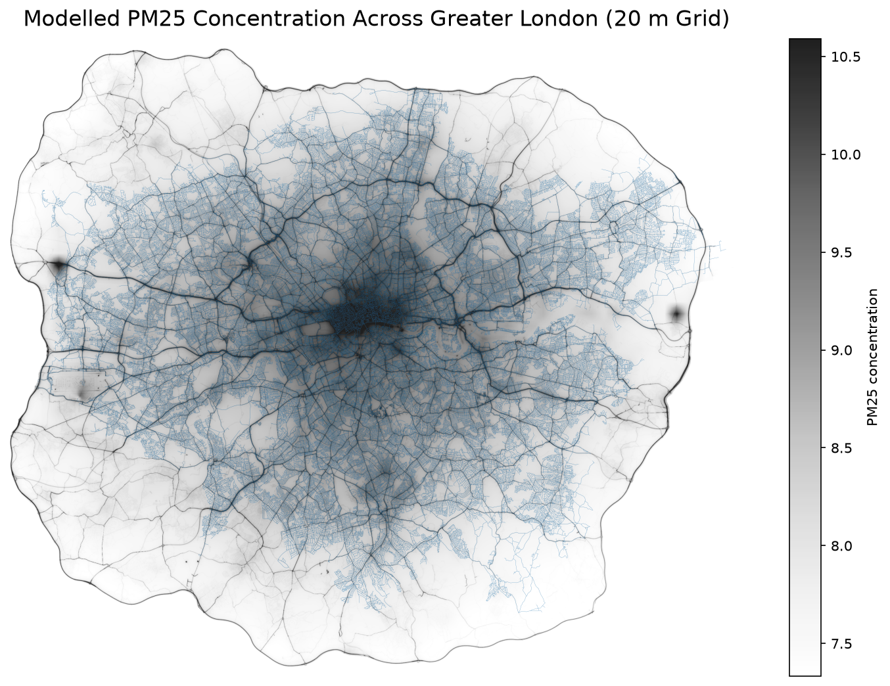

<link rel="stylesheet" href="css/style3.css"> 
<link rel="stylesheet" href="css/copycode.css"> 
<link rel="stylesheet" href="css/button.css"> 
<link rel="stylesheet" href="css/headerfooter.css"> 
<link rel="stylesheet" href="css/table.css"> 
<link rel="stylesheet" href="css/tree.css"> 
<link rel="stylesheet" href="css/rowcol.css"> 
<link rel="stylesheet" href="css/details.css">
<link rel="stylesheet" href="css/figure.css">

&nbsp; 

## Greater London {.c}

<figure> {width=100%}</figure>
<figure> {width=100%}</figure>
<figure> {width=100%}</figure>
<figure> {width=100%}</figure>
<figure> {width=100%}</figure> 

