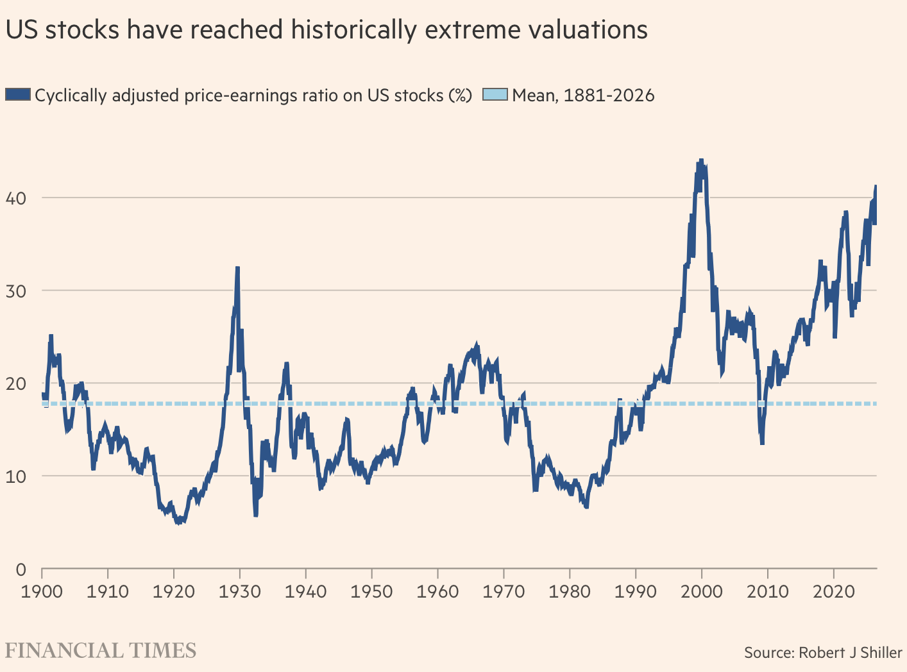
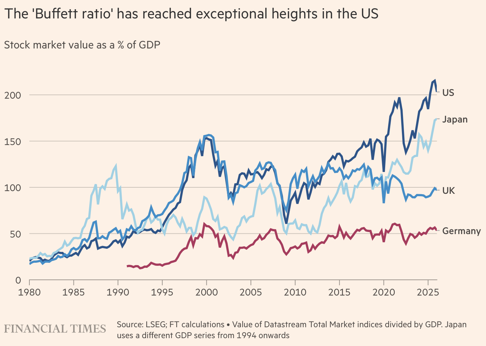
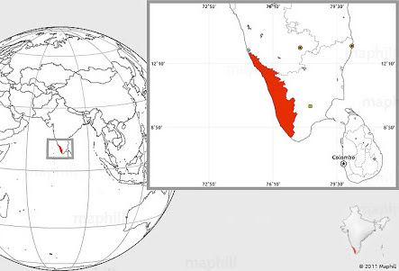
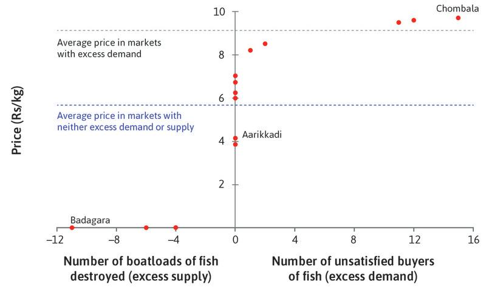
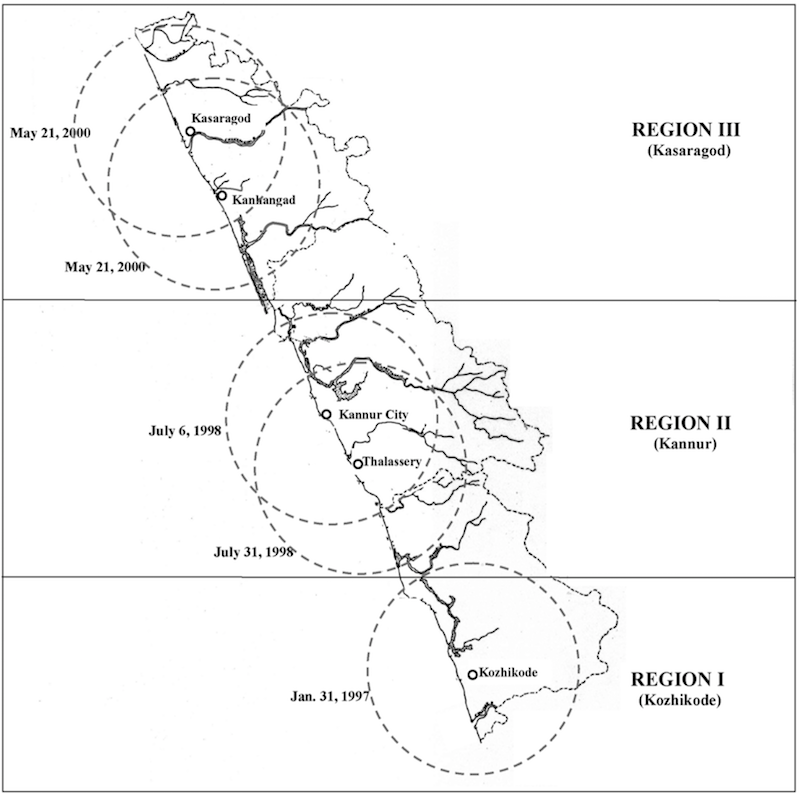
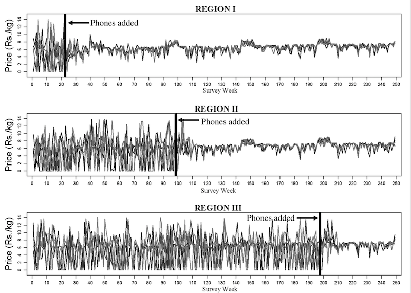
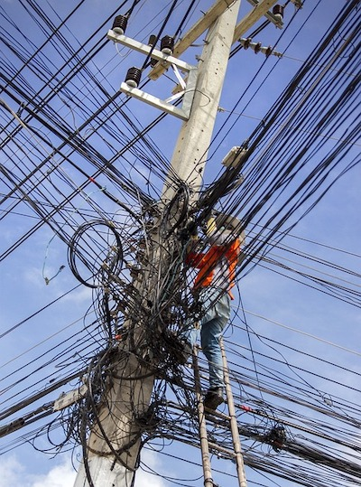
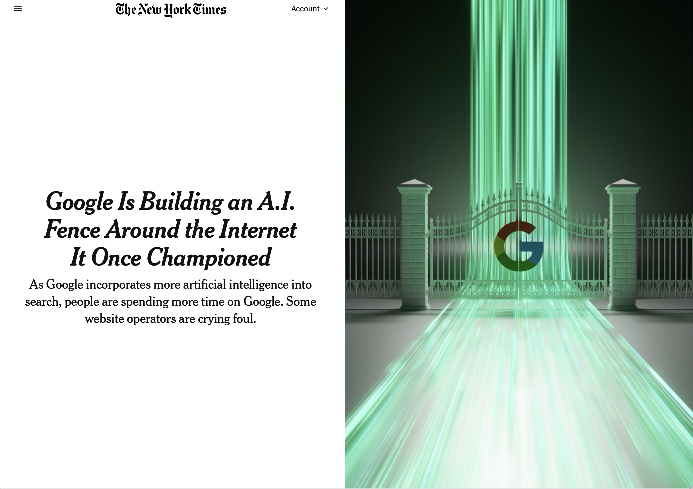

<link rel="stylesheet" href="/Users/aniket/_files/1/marp.css">

<!-- ### Urbanism and Geopolitics -->

&nbsp; 

&nbsp; 

&nbsp; 

&nbsp; 

### Humans in the Age of Artificial Intelligence: Automation, Market Structure and Skills

### Kumar Aniket

Associate Professor in Infrastructure, Automation and Economic Transformation  
Institute for Connected Communities  
University of East London  

&nbsp; 

<!-- Humans in the Age of Artificial Intelligence: Automation, Market Structure and Skills -->

<!-- 16th International Conference on Logistics, Informatics and Service Sciences (LISS2026), to be held 19–23 July 2026 at Wolfson College, University of Cambridge, United Kingdom. -->

&nbsp; 16th International Conference on Logistics, Informatics and Service Sciences  &nbsp;  
&nbsp; Wolfson College &nbsp;  
&nbsp; University of Cambridge &nbsp;  
&nbsp; 19–23 July 2026 &nbsp;  

<!-- ## Chittranjan Park   Delhi -->

<!--  -->

<!-- - [Jump to slide 1](#1) -->
<!-- - [Jump to slide 2](#2) -->
<!-- - [Jump to slide 3](#3) -->
<!-- - [Jump to slide 4](#4) -->
<!-- - [Jump to slide 5](#5) -->

---

<h2 id="perception-about-ai">Perception about AI</h2>

---

<h2 id="perception-about-ai-1">Perception about AI</h2>
<section id="cyclically-adjusted-priceearnings-ratio" class="fl">
<h4>Cyclically adjusted price/earnings ratio</h4>

CAPE is defined as today’s value of the stock
market divided by the average of the previous 10 years of earnings per
share, both in real terms.

</section>

---

<h2 id="perception-about-ai-2">Perception about AI</h2>
<section id="buffett-indicator" class="fl">
<h4>Buffett indicator</h4>

Buffett indicator ratio of the total value of
the stock market to GDP

</section>

---

<h2 id="coastal-fish-market-in-kerala">Coastal Fish Market in
Kerala</h2>
<h3 id="jensen2007digital">Jensen (<a href="#ref-jensen2007digital"
role="doc-biblioref">2007</a>)</h3>

<ul>
<li>Fish is the staple diet in Kerala, India
<ul>
<li>Kerala has a long coastline with fish markets dotted along the
coast</li>
</ul></li>
</ul>

Fisherman have a choice of which fish market they land their fish
in

<ul>
<li><strong>Information problem</strong> after the fisherman catch their
fish
<ul>
<li>They <strong>do not know</strong> the
<strong>price</strong> of fish in each market on a particular
day</li>
</ul></li>
</ul>

---

<h2 id="coastal-fish-market-in-kerala-1">Coastal Fish Market in
Kerala</h2>
<h3 id="jensen2007digital-1">Jensen (<a href="#ref-jensen2007digital"
role="doc-biblioref">2007</a>)</h3>

<ul>
<li>Fisherman had to <strong>choose</strong> the port/market where they
would get the best price for their catch
<ul>
<li>Fish merchants bought the fish from the fisherman and sold it to the
consumers
<ul>
<li>If fish merchants already had enough fish on the port they landed,
the fisherman would just <strong>jettison</strong> their catch</li>
</ul></li>
</ul></li>
</ul>

---

<h2 id="markets-dysfunctional">Markets dysfunctional</h2>

---

<h2 id="sequential-roll-out-of-mobile-phone-technology">Sequential Roll
out of mobile phone technology</h2>

 

---

<h2 id="section"></h2>

 

---

<h2 id="space-over-which-markets-operate">Space over which markets
operate</h2>

---

<h2 id="movement-is-an-essential-part-of-the-modern-economy">Movement is
an essential part of the modern economy</h2>

<!-- ### The key movement is flow of information -->
<ul>
<li><strong>New technology</strong> creates new space for information
flow
<ul>
<li>spaces that <strong>did not exist previously</strong></li>
<li>The space are especially customised for the <strong>flow of
information</strong></li>
</ul></li>
</ul>

---

<h2 id="movement-is-an-essential-part-of-the-modern-economy-2">Movement
is an essential part of the modern economy (2)</h2>
<section id="creating-space-for-movement-flow" class="fl">
<h3>Creating space for movement (flow)</h3>

<strong>Internal space</strong>

<ul>
<li>Requires creating an internal space which facilitates flows</li>
</ul>
</section>

---

<h2
id="movement-is-an-essential-part-of-the-modern-economy-2-1">Movement is
an essential part of the modern economy (2)</h2>

<h3 id="creating-space-for-movement-flow-1">Creating space for movement
(flow)</h3>

<strong>Internal space</strong>

<ul>
<li>Requires creating an internal space which facilitates flows</li>
</ul>

 

<section id="rules-of-the-space" class="note red">
<h3>Rules of the Space</h3>

<strong>Rules</strong> that govern the space and objects within it
that facilitate the flow within the space

<ul>
<li>isolate the space from external it immediate space</li>
<li>control <strong>entry</strong> and <strong>exit points</strong></li>
</ul>
</section>

---

<h2 id="movement-is-an-essential-part-of-the-modern-economy-3">Movement
is an essential part of the modern economy (3)</h2>

<section id="spatial-infrastructure" class="fr">
<h3>Spatial Infrastructure</h3>
<ul>
<li>There is a specific sub-class of infrastructure that facilitates
flow of information with its various intangible design elements that
adhere to these rules</li>
</ul>
</section>

---

<h2 id="three-waves-of-technology">Three waves of technology</h2>

<code>1960s–1980s</code>

<pre><code>┌-------------------------------------------------------------┐
| 1. Computational Foundation Wave (Data Creation/Storage)    |
|    - Silicon, Microprocessors, Relational Databases         |
└-------------------------------------------------------------┘</code></pre>

<code>1990s–2000s</code>

<pre><code>┌-------------------------------------------------------------┐
| 2. Connectivity &amp; Transmission Wave (Data Flow)             |
|    - Internet, TCP/IP, Cloud, Optical Fiber                 |
└-------------------------------------------------------------┘</code></pre>

<code>2010s–Present</code>

<pre><code>┌-------------------------------------------------------------┐
| 3. Cognitive / Intelligence Wave (Data Interpretation)      |
|    - Neural networks, ML, LLMs                              |
└-------------------------------------------------------------┘</code></pre>

---

<h2 id="layers-of-the-ai-stack">Layers of the AI Stack</h2>

 

<pre><code>.---------------.                            .----------------------------------.
|  Application  |    ----------------------  |  User interface and experience.  |
&#39;---------------&#39;                            &#39;----------------------------------&#39;
.---------------------.                      .--------------------------------.
|  Cognitive / Model  | -------------------  |  inference / decision-making.  |
&#39;---------------------&#39;                      &#39;--------------------------------&#39;
.-----------------.                          .----------------------------------.
|  Data Pipeline  |  ----------------------  |  sorting, information retrieval  |
&#39;-----------------&#39;                          &#39;----------------------------------&#39;
.-----------------------.                    .---------------.
|  Network / Transport  | -----------------  |  Moving data  |
&#39;-----------------------&#39;                    &#39;---------------&#39;
.---------------------------.                .-------------------------.
|  Infrastructure/Compute   |  ------------  |  Raw physical hardware  |
&#39;---------------------------&#39;                &#39;-------------------------&#39;  </code></pre>

---

<h2 id="technology-waves">Technology waves</h2>
<h3
id="each-wave-created-a-layer-that-allows-the-next-technological-waves-to-operate">Each
wave created a layer that allows the next technological waves to
operate</h3>

What is the relationship between the different layers

<ul>
<li>dynamic complementarity</li>
</ul>

 

<strong>Dynamic complementarity</strong>

<ul>
<li>complementarity</li>
<li>dynamic</li>
</ul>

---

<h2 id="market-structure">Market Structure</h2>

<strong>Market structure</strong> and market capture

<ul>
<li>market structure is organisational and competitive
<strong>characteristics</strong> of a market.</li>
<li>how <strong>competitive</strong> is a particular market segment</li>
</ul>

---

<h2 id="krugman1987free">Krugman (<a href="#ref-krugman1987free"
role="doc-biblioref">1987</a>)</h2>
<ul>
<li>Jumbo jet market</li>
</ul>

<strong>Takeaway</strong>

<ul>
<li>The greater the scale effects, the more fewer the firms in the
market</li>
<li>Scale becomes a strategic tool</li>
<li>Increase the</li>
</ul>

Why does <strong>market capture</strong> matter?

<ul>
<li><strong>Dynamic complementarity</strong></li>
</ul>

---

<h2 id="new-york-times-article-yesterday">New York Times article
yesterday</h2>

Conger (<a
href="#ref-nyt2026google" role="doc-biblioref">2026</a>)

---

<h2 id="history-of-competition-policy">History of Competition
Policy</h2>

 

<h3 id="post-war-era">Post-war era</h3>
<ul>
<li>state held the power</li>
<li>Policies prevented market capture</li>
</ul>
<h3 id="s-onwards">1980s onwards</h3>

<ul>
<li>we have seen the power shit from the state to private players</li>
</ul>

<strong>Silicon Valley Consensus</strong>

<ul>
<li>2000s have increased their market power</li>
</ul>

---

<h2 id="section-1"></h2>

 

 

<h3
id="the-economics-of-market-capture-will-determine-how-the-benefits-of-ai-are-distributed.">The
economics of market capture will determine how the benefits of AI are
distributed.</h3>

---

<h2 id="section-2"></h2>

Conger, K. (2026). Google is building an a.i. Fence around the internet
it once championed. <em>New York Times</em>.

Jensen, R. (2007). The digital provide: Information (technology), market
performance, and welfare in the south indian fisheries sector. <em>The
Quarterly Journal of Economics</em>, <em>122</em>(3), 879–924.

Krugman, P. R. (1987). Is free trade passé? <em>Journal of
Economic Perspectives</em>, <em>1</em>(2), 131–144.

